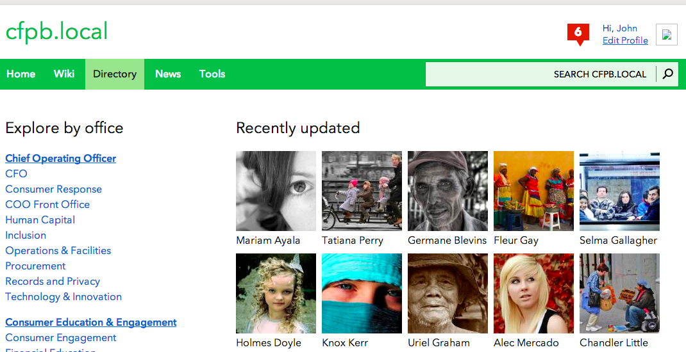

#Staff Directory

[](https://travis-ci.org/cfpb/collab-staff-directory)

*Staff Directory* is a [Collab](https://github.com/cfpb/collab) application to show all profiles from the application's active users.


##Pages

Staff Directory has different views:

* Index page
* Profile page
* Office view
* Tag view
* Thank page

##Screenshot



##Installation

To use this application you will need to first have [Collab](https://github.com/cfpb/collab) installed.

Then, once you clone this repo, you can install the application using setuptools:

`python setup.py install`

Or, if you are developing with this app, you can add it to your search path like:

```
cd collab
ln -s ../collab-staff-directory/staff_directory .
```

Once the application is installed, add it to core collab's `INSTALLED_APPS` in your `local_settings.py` file:

```
INSTALLED_APPS += ( 'staff_directory', )
```

##Contributing

Please read the [contributing guide](./CONTRIBUTING.md).